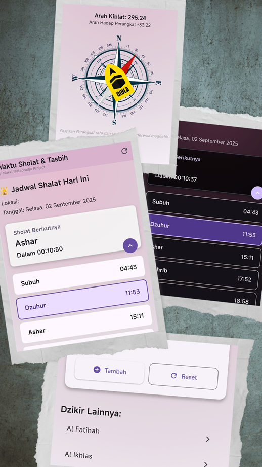

# 🕌 Aplikasi Sholat

> Aplikasi waktu sholat harian yang akurat, ringan, dan penuh fitur — dirancang khusus untuk memudahkan ibadah Muslim.


 

Aplikasi **Sholat** membantu Anda tetap konsisten dalam menjalankan sholat 5 waktu dengan jadwal yang akurat berdasarkan lokasi Anda. Dilengkapi fitur notifikasi, arah kiblat, dzikir harian, dan tema dinamis, aplikasi ini hadir sebagai teman ibadah digital yang setia.

---

## ✨ Fitur Utama

- 🕰️ **Jadwal Sholat Akurat**  
  Menggunakan lokasi Anda dan algoritma [Adhan](https://github.com/bibby/Adhan) untuk menghitung waktu sholat secara presisi.

- 🔔 **Notifikasi Otomatis**  
  Dapatkan notifikasi tepat waktu untuk setiap sholat, bahkan saat aplikasi ditutup.

- 🔄 **Update Otomatis di Latar Belakang**  
  Jadwal sholat diperbarui setiap hari tengah malam menggunakan `Workmanager`.

- 🎨 **Tema Dinamis (Aura Color)**  
  Warna aplikasi berubah sesuai waktu sholat aktif (Subuh biru, Dzuhur emas, dll).

- 🌙☀️ **Mode Terang & Gelap**  
  Pilih tema sesuai kenyamanan Anda.

- 🧮 **Penghitung Dzikir**  
  Catat jumlah dzikir harian dengan antarmuka digital yang intuitif.

- 🧭 **Arah Kiblat**  
  Temukan arah kiblat menggunakan sensor kompas perangkat.

- 💾 **Offline-First & Cache Lokal**  
  Jadwal sholat disimpan secara lokal menggunakan `SharedPreferences`, tetap bisa digunakan tanpa internet.

- 🌍 **Multi-Lokasi (Coming Soon)**  
  Pilih kota manual tanpa perlu GPS.

---

## 🛠️ Teknologi & Arsitektur

- **Framework**: [Flutter](https://flutter.dev)
- **State Management**: [GetX](https://pub.dev/packages/get)
- **Background Task**: `workmanager`
- **Lokasi**: `geolocator`, `geocoding`
- **Notifikasi**: `flutter_local_notifications`, `timezone`
- **Penyimpanan**: `shared_preferences`
- **Perhitungan Waktu Sholat**: `adhan_flutter`
- **Arsitektur**: Modular, Clean Architecture + Feature-based

---

## 📦 Instalasi

1. Clone repositori:
   ```bash
   git clone https://github.com/username/sholat.git
   cd sholat

📄 Lisensi
Dilisensikan di bawah MIT License .

🤲 Dukung Proyek Ini
Jika aplikasi ini bermanfaat bagi Anda, pertimbangkan untuk:

Memberikan ⭐ di GitHub
Membagikannya ke sesama Muslim
Berkontribusi (issue, PR, terjemahan)
Semoga menjadi amal jariyah yang terus mengalir. Aamiin.